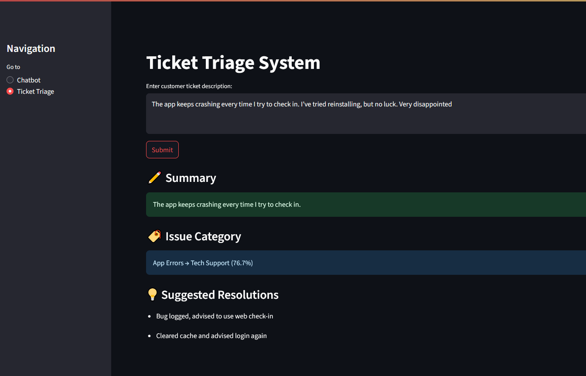

# ✈️ Light Airlines AI Support Assistant

An AI-powered customer support platform designed for airline operations, hosted on [Hugging Face Spaces](https://huggingface.co/spaces/melopixe/light-airlines-ai-support) and built with Streamlit.

## 🌐 Live Demo

👉 [Launch the App](https://huggingface.co/spaces/melopixe/light-airlines-ai-support)

## 🎯 Features

- **🧠 Intelligent Chatbot**: RAG-powered assistant for real-time, context-aware support.
- **📨 Automated Ticket Triage**: Summarizes and routes support tickets to the right teams.
- **👥 Passenger Segmentation**: Visual clustering of customer profiles for targeted marketing or support.
- **📢 Personalized Delay Alerts**: Flight disruption notifications tailored to passenger tier and preferences.

## ⚙️ Tech Stack

- Python
- Streamlit
- Hugging Face Spaces
- RAG (Retrieval-Augmented Generation)

## 🚀 Getting Started (Run Locally)

```bash
git clone https://github.com/zahraabdulrahman/light-airlines-ai-support.git
cd light-airlines-ai-support
pip install -r requirements.txt
streamlit run app.py
```

## 🖼️ Preview



